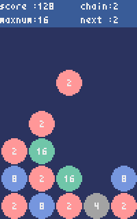

# ニノベキブロックパズル

## 概要
落ちてくる2のベキ数のブロックを操作する落ち物パズルです。  
  
同じ数のブロックを隣接させるとくっつき得点を得られると同時に元の数の２倍の数のブロックができます。連鎖をさせることで高得点を得られます。  
  
※このゲームは[Pyxel](https://github.com/kitao/pyxel)を使用して作成しました。

## 環境
Python3.8以上  
Pyxel==1.5.0

## 実行方法
```
python main.py
```

## 操作方法
Enter: ゲーム開始  
左右矢印: ブロック左右移動  
下矢印: ブロック高速落下
 